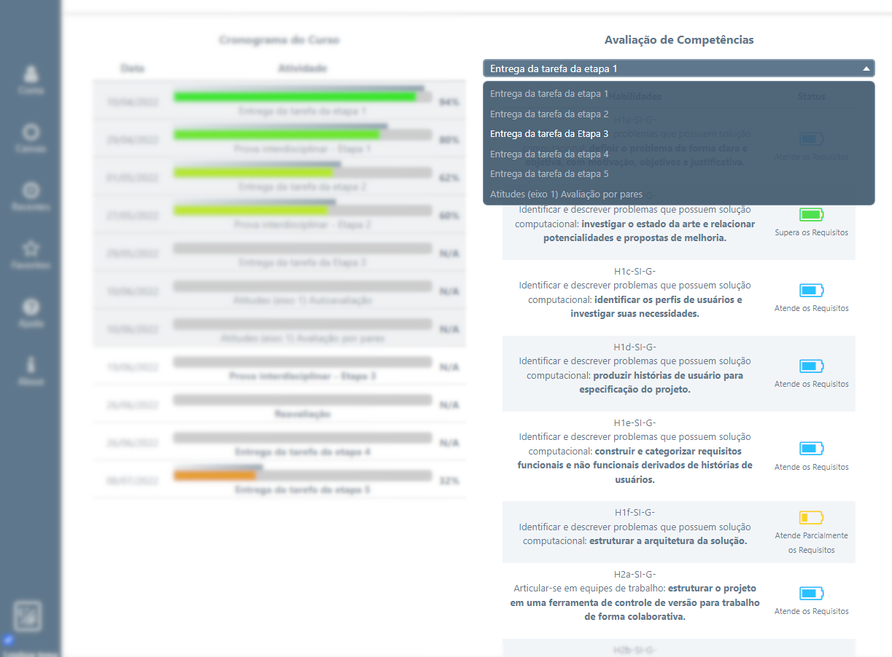

# Programação de Funcionalidades

Implementação do sistema descritas por meio dos requisitos funcionais e/ou não funcionais. Deve relacionar os requisitos atendidos os artefatos criados (código fonte) além das estruturas de dados utilizadas e as instruções para acesso e verificação da implementação que deve estar funcional no ambiente de hospedagem.

Para cada requisito funcional, pode ser entregue um artefato desse tipo

## Conteúdo do Curso

|ID    | Descrição do Requisito  | Prioridade |
|------|-----------------------------------------|----|
|RF-001| Exibir uma trilha pedagógica | ALTA |
|RF-003| Identificar aulas/eixos já concluídos  | ALTA  |

- O conteúdo do curso é disposto em uma estrutura em forma de árvore, que permite o acesso a todas as aulas disponíveis no semestre.
- À medida que as *Atividades Objetivas* são realizadas, o sistema identifica o microfundamento correspondente como concluído, permitindo ao aluno acompanhar seu progresso.  

## Cronograma do Curso

|ID    | Descrição do Requisito  | Prioridade |
|------|-----------------------------------------|----|
|RF-002| Exibir indicador de progresso do aluno | ALTA |
|RF-004| Exibir uma barra de *status* | ALTA |
|RF-007| Gamificar o progresso do aluno |	MÉDIA |

- O conteúdo do curso é divido por semana, conforme a programação feita pelo professor na *Área do Professor*.
- O progresso do aluno é apresentado de acordo com a pontuação obtida nas *Atividades Objetivas* e nas *Provas Interdisciplinares*.
- Em cada atividade há uma barra azul acima do progresso do aluno, que mostra o desempenho médio da turma. Assim o aluno poderá avaliar seu desempenho em relação à média da turma. 

## Avalições de Rúbricas

|ID    | Descrição do Requisito  | Prioridade |
|------|-----------------------------------------|----|
|RF-005| Reunir notificações/notas/datas ao aluno no *dashboard* | ALTA |

- Nesta seção o aluno poderá verificar as competências a serem desenvolvidas em cada Etapa, bem como o status das habilidades avaliadas.
- Cada status de avaliação possui um ícone e cor especícos, facilitando ao aluno identificar os pontos fortes e onde precisa dar atenção.

> **Links Úteis**:
>
> - [Trabalhando com HTML5 Local Storage e JSON](https://www.devmedia.com.br/trabalhando-com-html5-local-storage-e-json/29045)
> - [JSON Tutorial](https://www.w3resource.com/JSON)
> - [JSON Data Set Sample](https://opensource.adobe.com/Spry/samples/data_region/JSONDataSetSample.html)
> - [JSON - Introduction (W3Schools)](https://www.w3schools.com/js/js_json_intro.asp)
> - [JSON Tutorial (TutorialsPoint)](https://www.tutorialspoint.com/json/index.htm)
