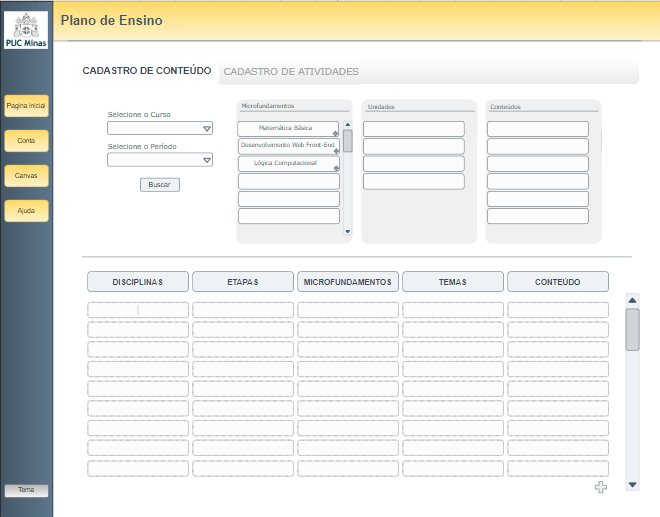

# Projeto de Interface

A plataforma 3A conta, essencialmente, com 2 (duas) telas principais: a **página do aluno** e a **página do professor**.

A **página do aluno** reúne praticamente todos os requisitos funcionais do projeto, suprindo as necessidades elicitadas a partir da análise das histórias de usuário. A página conta, então, com a presença dos seguintes elementos:

> - trilha pedagógica, com a identificação das aulas/eixos já concluídos;
> - exibição dos indicadores de progresso do aluno;
> - a barra de status;
> - notificações, notas e datas importantes.

Vale ressaltar que a página do aluno também permite o acesso a um painel que contém as informações e configurações de usuário, além de um tutorial dinâmico quando da realização do primeiro acesso.

Já a **página do professor** se ocupa, basicamente, de viabilizar o cadastro da trilha pedagógica pelo coordenador do curso, servindo-se de todas as ferramentas necessárias para o cumprimento de tal propósito (listagem dos conteúdos e instrumentos de ordenação da jornada de ensino).

As demais telas existentes – **login**, **ajuda** e **about** - detêm a função de acesso e suporte às principais, prestando-lhes auxílio e esclarecimentos a respeito do projeto.

O design da página web será responsivo, vindo a sofrer alterações de exibição a partir das peculiaridades do dispositivo utilizado pelo usuário, cumprindo, plenamente, os requisitos não funcionais anteriormente previstos.

## User Flow

## Wireframes

### Tela do Aluno 1

### Tela do Aluno 2

### Tela do Aluno 3

### Recentes

### Tela do professor

### Tela do professor 2

### Tema escuro

### Perfil do usuario

### About

### Login

