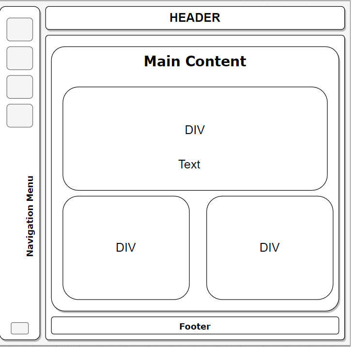
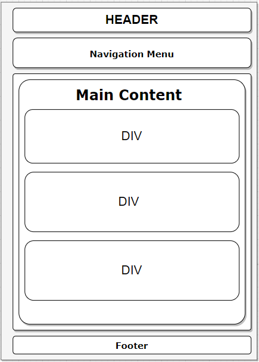

# Template padrão do site

O layout padrão do site contará com uma *header*, um elemento *nav* à esquerda com os *links* de navegação, um elemento *content* com *divs* que abrangem as seções de dados necessárias a dar suporte às funções da plataforma, bem como um *footer* contendo informação adicional.

# Modelo web

# Modelo Mobile

